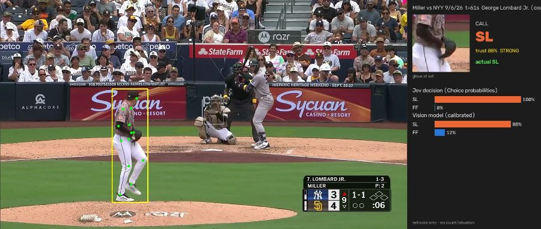
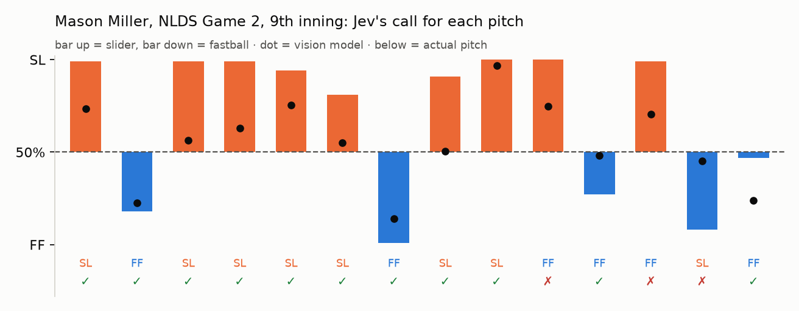
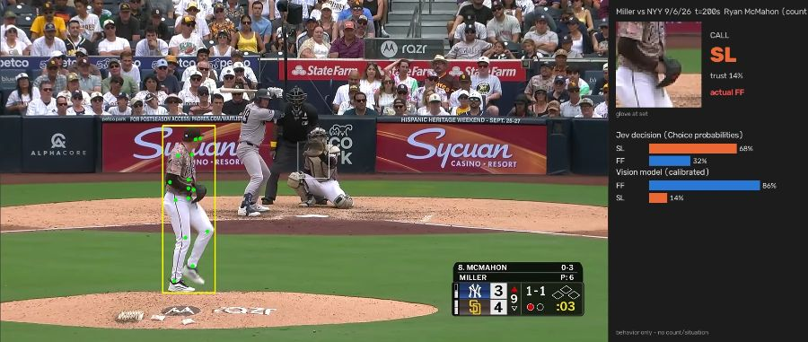
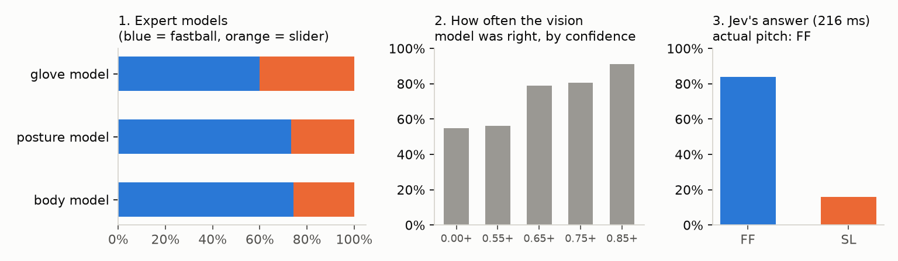

# pitchtip

pitchtip guesses a pitcher's next pitch from video of the pitcher before he throws.
It looks at his set position, his glove and hands, his arm angles, and the start of his leg
lift. It does not use the count, the runners, or any other game information.

The video is turned into body measurements on your own computer. Then
[Jev](https://typesafe.ai), a cheap and fast decision model from TypeSafe AI, makes the call.

It works on Baseball Savant clips, recorded games, and YouTube or other video streams.


*One call from a YouTube video of Mason Miller. Left: the frame where his leg lift started.
Right: the glove area the model looked at, Jev's probabilities, and the vision model's probabilities.*

## How it works

1. A small pose model (YOLO11n) finds the pitcher in every frame. A larger, more accurate
   pose model (YOLO11x) then measures his body during the set and the start of the leg lift.
2. pitchtip measures arm angles, hand, glove and head positions over time, how long he holds
   the set, and how far his elbows stick out. It also builds an image fingerprint of the glove
   area with DINOv2 to capture the grip, the glove shape, and whether the ball shows.
3. Three small models each give an opinion: one on body movement, one on the glove image,
   and one on simple posture.
4. Jev gets one multiple-choice question. The options are the pitcher's pitches. The question
   comes with the three opinions, how reliable each has been for this pitcher, the 25 most
   similar past deliveries, and his known tells. Jev returns a probability for each pitch.
5. Each call gets a trust score. The top 25% of calls by trust are marked STRONG.

## Results

All results use body language only, and every test is on games the model never trained on.

### Most pitchers can be read from their body language

We tested 20 pitcher-seasons, about 9,500 pitches, on fastball vs offspeed. Each later
group of games was predicted using only earlier games, the same way it would run during a
season.

| | accuracy |
|---|---|
| always guess the pitcher's most common pitch | 57% |
| **Jev** | **68%** |
| Jev, STRONG calls only | 80–95%, depending on the pitcher |


| easiest to read | base rate | Jev | | hardest to read | base rate | Jev |
|---|---|---|---|---|---|---|
| Tyler Glasnow 2019 | 71% | **88%** | | Garrett Crochet 2025 | 75% | 74% |
| Mason Miller 2026 | 54% | **78%** | | Yusei Kikuchi 2025 | 62% | 64% |
| Ryan Helsley 2024 | 54% | **75%** | | Yoshinobu Yamamoto 2024 | 53% | 60% |
| Max Fried 2025 | 55% | **73%** | | Zac Gallen 2025 | 55% | 61% |

Calling the exact pitch type instead of fastball vs offspeed: Glasnow 90% (base rate 71%),
Helsley 64% across 3 pitches (base 47%), Fried 31% across 6 pitches (base 21%).

### It finds known tips without being told about them

- **Tyler Glasnow, 2019.** He confirmed that his glove sat higher before fastballs. With no hints,
  pitchtip's top tell for him was "glove hand high in the set means fastball 79% of the time,
  vs 68% overall." In 2020, after he fixed it, he became much harder to read (AUC 0.93 to 0.75).
- **Ryan Helsley, 2025.** He was reported to have an arm movement when coming set. pitchtip's top
  tell for him was how far his glove elbow sticks out in the set.
- **Mason Miller, 2026 NLDS Game 2.** Brewers hitters were accused of reading his glove. Replaying
  that game, pitchtip got 29 of 37 pitches right (base rate 51%), and all 7 STRONG calls were right.
- **Stephen Strasburg, 2019 World Series Game 6.** pitchtip missed this one at first (6 of 12 in the
  first inning). His tell happened while he was bringing his hands into the set, which was before
  the part of the video we were looking at. We added features for that phase.

### Patterns across pitchers

Every one of the 15 pitcher-seasons we checked had at least one tell that was statistically
significant. The most common tell was elbow angle, on the glove arm or the throwing arm.
Hand and glove height came next. Tells showed up in the set, in the last moments before the
leg lift, and at the start of the lift, so watching only the set position misses some.

### YouTube videos and live streams

We ran pitchtip on full innings of Mason Miller from YouTube and scored each call against the
real pitch from the MLB game data.



| test | correct | base rate | STRONG calls |
|---|---|---|---|
| Mason Miller, 3 YouTube innings, called after the lift starts | **29/39 (74%)** | 69% | 8/9 |
| Mason Miller, same innings, called **before** the leg lift | **28/38 (74%)** | 68% | 10/13 |
| Garrett Crochet, first Red Sox start (trained on his other 2025 games) | 16/19 (84%) | 84% | 4/4 |
| Tyler Glasnow, 2019 ALDS Game 5 (clips joined into one video) | 33/35 (94%) | 68% | 7/7 offspeed calls |
| Freddy Peralta, Sept 22 2025 (clips joined into one video) | 46/66 (70%) | 55% | |

- Live mode reads straight from a stream link. It ran about 1.9 times faster than real time on an
  Apple-silicon laptop.
- In before-the-lift mode, the call is ready about 0.17 seconds before the leg lift starts. That
  is about 1.2 to 1.6 seconds before the ball is thrown.
- Calling before the lift costs about 6 points of accuracy on average for the five easiest
  pitchers to read. It still beats the base rate by 13 to 19 points.
- Crochet throws a fastball most of the time, so pitchtip only matched his base rate. Its STRONG
  calls were still right.


*A miss: pitchtip called a slider and he threw a fastball. The vision model leaned fastball, but
Jev went with slider.*

### How Jev is used



- Jev does not look at the video. For each pitch it gets one multiple-choice question plus the
  evidence above. A full real example is in [`docs/jev_example.json`](docs/jev_example.json).
- pitchtip picks which evidence to give Jev for each pitcher, based on what worked best on his
  most recent games.
- Jev almost always answers with close to 0% or 100%, so its own confidence does not tell you
  which calls to trust. pitchtip uses the vision model's confidence for that, and that is what
  the STRONG label is.
- Each call costs about $0.003 per 1,000 pitches and takes 0.1 to 0.2 seconds.
- Jev was about as accurate as the free local model. It did not beat it by a real margin,
  because it can only work with the evidence the video gives it.

### What helped and what didn't

| change | result (Glasnow 2019) |
|---|---|
| bigger pose model: YOLO11s, m, l, then **x** | AUC 0.78, 0.86, 0.89, **0.93** |
| glove image fingerprint (DINOv2) | the glove model alone reached AUC ~0.86 |
| hand and arm paths around the leg lift | +2–3 AUC points |
| bigger glove image model (DINOv2-base) | worse, because the glove is only ~30 pixels wide |
| asking Jev several questions and averaging | no gain |
| running pose on a crop around the pitcher (faster) | slightly worse (0.90 vs 0.93) |

Mistakes we found and fixed. These are worth knowing if you build on this:
- A timing feature measured how long the delivery took, because Savant cuts its clips around
  the release. That leaked the pitch type, so we removed it.
- A "runners on base" flag used the base state after the play instead of before it.
- Some clip links ended in an encoded `=` sign, which silently dropped every 2019 playoff clip.

## Keys and requirements

| what | needed? | where |
|---|---|---|
| `TYPESAFE_API_KEY` | **yes, for Jev calls.** The local model works without it. | [console.typesafe.ai](https://console.typesafe.ai) (early access) |
| MLB Stats API, Baseball Savant | no key needed | public |
| `yt-dlp` | only for YouTube or stream links | used through `uvx` if installed, or `brew install yt-dlp` |
| GPU | strongly recommended | Apple silicon or an NVIDIA GPU. YOLO11x takes ~2 s per clip on an M-series laptop. |
| disk | ~5 MB per clip while scanning | `scan` deletes each clip after its pose data is saved |

```bash
uv sync
cp .env.example .env        # then add your TYPESAFE_API_KEY
```

## Usage

```bash
# 1. Get data: pitch labels from MLB, clips from Savant, pose data, glove fingerprints
uv run pitchtip scan "Mason Miller:2026" "Max Fried:2025:15" --game-type R --game-type D

# 2. Look for tells
uv run pitchtip leaderboard                         # which pitchers are easiest to read
uv run pitchtip patterns                            # common tells across pitchers
uv run pitchtip tips "Mason Miller 2026" --mode fb  # ranked tells for one pitcher

# 3. Test it
uv run pitchtip rolling "Mason Miller 2026" --mode fb             # season-style test
uv run pitchtip demo "Mason Miller 2026" --game 849825 --mode fb  # replay one game

# 4. Videos and streams
uv run pitchtip ytest video.mp4 "Mason Miller 2026" 823253 --out out/ --innings 9   # score a video
uv run pitchtip live "https://www.youtube.com/watch?v=..." "Mason Miller 2026" --set-only
```

Datasets are named `"<Pitcher Name> <season>"`. A tip belongs to one pitcher during one
period, so each pitcher-season gets its own model.

## How to improve this

Roughly in order of how much we think each would help:

1. **More games per pitcher.** We stopped the YOLO11x scan partway, and many pitcher-seasons
   have only 15 games. Accuracy went up with more data every time we checked. Run `scan`
   without a game limit.
2. **A glove detector and sharper video.** The most common known tip is seeing the grip in the
   glove. In 720p center-field video the glove is only about 30 pixels wide. A glove or ball
   detector, or 1080p video, should help the most.
3. **Faster leg-lift detection for live use.** The small tracker sometimes notices the lift 2 to 4
   seconds late. A better fast tracker would make the before-the-lift calls more consistent.
4. **Calibrate Jev.** Jev's probabilities are too extreme. Calibrating them, or giving Jev a few
   examples per pitcher, might let it beat the local model instead of just matching it.
5. **More camera angles.** Tips in the face of the glove or the mouth need a front or side view.
   Savant's per-pitch clips only have the center-field view.
6. **Watch for changes.** Pitchers fix their tips during a season. Retrain on recent games and
   flag when a pitcher suddenly gets easier to read. Teams could also use this on their own
   pitchers to catch tipping early.
7. **Test more pitchers on video.** Most of the video tests so far are Mason Miller.

## Data and limits

- Clips and broadcast video belong to MLB and the broadcasters. Use them for personal research.
  The `data/` folder is not committed and no video is in this repo. The few still frames above
  are annotated examples.
- Each video test is one game or a few innings (19 to 76 pitches). The season-style test over
  ~9,500 pitches is the more reliable number.
- Being able to read a pitcher does not mean a hitter can hit him. Teams also report that many
  "tipping" claims turn out to be wrong.

More detail, the list of known tips we used to check our work, and every experiment are in
[`docs/TIPPING.md`](docs/TIPPING.md) and [`docs/tip_catalog.csv`](docs/tip_catalog.csv).
