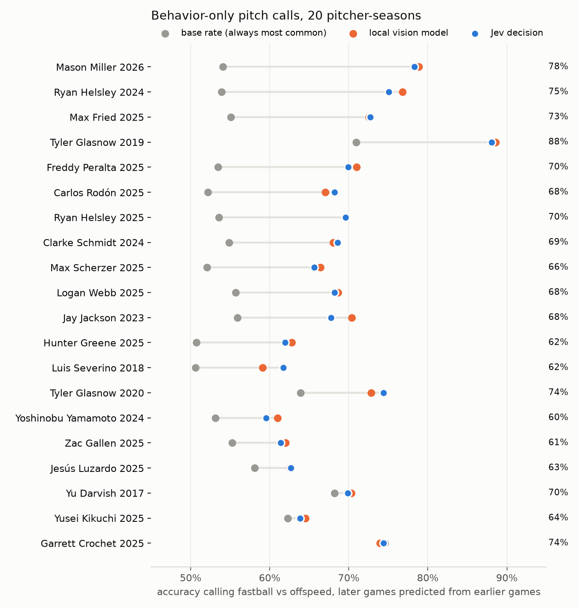
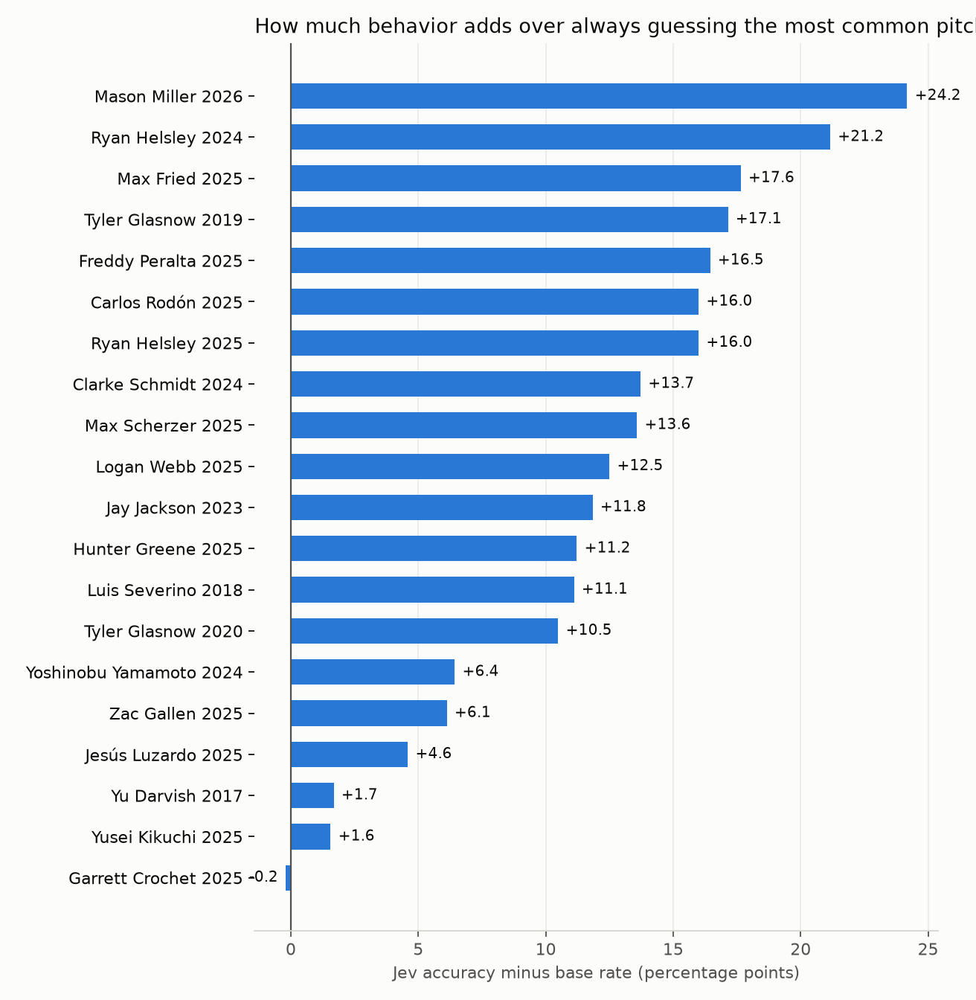

# What pitch tips actually look like

Research summary that drives pitchtip's feature design. Validation targets with dates and
sources are in [`tip_catalog.csv`](tip_catalog.csv).

## Mechanisms (≈18 documented MLB cases, 2016–2026)
| mechanism | share | examples | pitchtip feature |
|---|---|---|---|
| Ball / grip visible in the glove | ~45% | Schmidt '24, Luzardo '25, Yamamoto '24, Scherzer '25 | `set_hand_bright_frac`, glove-patch PCA (next: DINOv2 crop) |
| Glove / hands height at the set | ~33% | Glasnow '19, Severino '18, Danks | `set_hands_y`, `set_glove_wrist_y`, `set_hands_to_chin` |
| Re-grip / hand motion in the glove | ~22% | Darvish '17, Strasburg '19 | `set_hand_motion_*`, `set_throw_wrist_travel`, `*_std` jitter |
| Timing / tempo | rare | Darvish (Jul '17), Jackson '23 | `set_still_seconds`, `onset_time` |
| Elbows / arms | rare | Helsley '25, Pettitte | `set_elbow_spread`, `*_elbow_out` |
| Head / mouth / gum | rare | Severino glance, Newcomb gum | `head_*` only (mouth not visible from CF) |
| Feet / rubber | rare | historical | not modelled yet |

## Practical rules
- Most modern tips happen **from the stretch with a runner on 2B**, who sees roughly what
  the CF broadcast camera sees. Use `--situation men_on|risp`.
- Tips are **per pitcher and per period** (fixed within days). Evaluate on held-out games,
  ideally chronologically (`--split chrono`), and against a count/situation baseline.
- A RHP in the stretch faces 3B, so CF sees his right side and back. Glove-face flare and
  mouth tells generally need a front view, which the per-pitch clips don't have.
- **False positives are common.** Teams use outcome-independent review: getting hit hard ≠
  tipping (Urías 2023 was reviewed and cleared).

## Prior work
- Ishii, Cal Poly MS thesis 2021: set-position pose + object detection, Glasnow/Darvish/
  Strasburg, ~70%.
- Piergiovanni & Ryoo 2018 (MLB-YouTube): full-pitch video, 36% over 6 pitch types.
- Bright et al. 2026 (arXiv 2603.04874): 80% from 3D pose, but uses release-phase
  features, so it is not a pre-release tip test.

## Validation: blind rediscovery of Glasnow's documented tip
Glasnow confirmed that in 2019 his glove sat higher at the set for fastballs and lower for
curveballs, and that he fixed it for 2020 by varying his glove height. pitchtip was not
told any of this.

| Glasnow, glove/hands height at set | pitches | AUC FF vs CU | p |
|---|---|---|---|
| 2019 regular season (8 games) | 418 | **0.64** | 1e-5 |
| 2019 ALDS G5 (the famous game, 2.2 IP) | 31 | 0.68 | 0.11 (too few pitches) |
| 2020 after the fix (10 games) | 626 | 0.52 | 0.38 |

- In 2019 the blind tell ranking put "hands high in the set → FF 81% (vs 71%)" and "glove
  hand low → CU 40% (vs 29%)" in its top 3 (q ≈ 2e-4).
- In 2020 the tell disappears, and his glove-height spread rises 28%, consistent with
  deliberately varying it.
- The effect is about 0.6% of body height. A hitter can see it live, but it takes
  hundreds of pitches to confirm statistically.

## Darvish 2017 (late season + postseason, 1,197 pitches), fastball vs offspeed
| split | accuracy | base rate | AUC |
|---|---|---|---|
| game-grouped CV | 67.7% | 67.8% | 0.67 |
| chronological (train early, test late incl. WS) | **70.6%** | 65.4% | **0.71** |
| Jev (raw features, same late split) | 61.8% | 62.3% | 0.58 |
| Jev fusion (vision probs + situation) | 67.6% | 62.3% | 0.63 |

Top-decile confident fastball calls: about 90% fastballs vs a 68% base rate.

## Behavior-only results (no count, no runners, no situation)
Features: pose + trajectories around the leg lift, plus DINOv2 embeddings of the glove
region. Model: stacked experts (body trees / glove-appearance / linear posture).
Decision: Jev (`jev-preview` / `jev-latest`) given the expert probabilities, the most
visually similar past deliveries, the tells, and the vision model's track record.

### Leaderboard, fastball vs offspeed (game-grouped CV, 16 pitcher-seasons, ~24k pitches scanned)
| pitcher-season | n | AUC | acc | base | acc on 25% most confident |
|---|---|---|---|---|---|
| Tyler Glasnow 2019 (documented tip) | 614 | **0.82** | 77.7% | 68.2% | 92.2% |
| Ryan Helsley 2025 (documented tip) | 923 | **0.79** | 71.2% | 53.7% | 87.8% |
| Freddy Peralta 2025 | 1088 | **0.77** | 70.4% | 51.3% | 83.1% |
| Max Fried 2025 | 1358 | 0.74 | 69.0% | 56.5% | 81.1% |
| Zac Gallen 2025 | 1068 | 0.68 | 66.0% | 53.7% | 73.0% |
| Jesús Luzardo 2025 | 2385 | 0.68 | 63.6% | 56.7% | 77.0% |
| Carlos Rodón 2025 | 1333 | 0.68 | 63.9% | 53.8% | 72.4% |
| Garrett Crochet 2025 | 1221 | 0.67 | 74.7% | 74.5% | 87.5% |
| Tyler Glasnow 2020 (after his fix) | 767 | 0.66 | 66.2% | 63.1% | 78.5% |
| Max Scherzer 2025 | 1283 | 0.66 | 62.7% | 50.2% | 70.9% |
| Clarke Schmidt 2024 | 1170 | 0.64 | 61.8% | 56.8% | 71.2% |
| Luis Severino 2018 | 1051 | 0.64 | 60.0% | 52.7% | 71.0% |
| Yoshinobu Yamamoto 2024 | 651 | 0.63 | 61.1% | 54.1% | 67.3% |
| Yu Darvish 2017 | 1250 | 0.62 | 67.9% | 67.4% | 77.6% |
| Yusei Kikuchi 2025 | 1264 | 0.61 | 62.9% | 63.9% | 78.2% |
| Logan Webb 2025 | 931 | 0.58 | 56.1% | 53.9% | 62.5% |

The two pitchers with confirmed, CF-visible tips rank 1 and 2. For Glasnow, the glove-appearance
expert alone reaches AUC 0.86, which fits a glove-position tell.

### Rolling deployment eval (each later block predicted from all earlier games)
Fastball vs offspeed:

| pitcher | n | base | local | **Jev** |
|---|---|---|---|---|
| Peralta 2025 | 430 | 53.9% | 69.5% | **70.0%** |
| Fried 2025 | 557 | 54.6% | 66.2% | **67.5%** |
| Glasnow 2019 | 212 | 71.7% | 74.5% | **77.4%** |
| Rodón 2025 | 526 | 52.8% | 64.8% | **66.3%** |
| Helsley 2025 | 372 | 54.8% | 64.8% | **65.3%** |
| Luzardo 2025 | 1006 | 57.9% | 65.0% | 64.5% |
| Schmidt 2024 | 506 | 53.9% | 57.7% | **58.3%** |
| Darvish 2017 | 474 | 68.1% | 67.1% | 65.6% |

Jev decision cost is about $0.003 per 1,000 pitches, with ~120–220 ms latency.

### Pose-model upgrade: YOLO11s → YOLO11m
The pitcher is only ~250 px tall on broadcast, so keypoint quality matters. On Glasnow 2019
(rolling eval, FB vs offspeed), switching to YOLO11m moved the local model from
AUC 0.78 / 70.8% to **AUC 0.86 / 81.0%**. Jev with the vision model's track record reached
**82.0%** (base rate 70.7%). The pipeline now defaults to YOLO11m, and all pitchers are
being re-scanned with it. The YOLO11s tables in this document are kept for reference.

**Live replay of ALDS G5 with YOLO11m and Jev (trust variant): 33 of 35 called pitches
correct (94%), against a 68% base rate. All 7 offspeed calls were correct.**

### Live replay: Glasnow, 2019 ALDS Game 5 (the famous tipping game)
`pitchtip reel` stitched the game into one continuous video. `pitchtip live --train-before
2019-10-10` had to find the pitcher, detect the set and leg lift, and call each pitch.
- **32 of 37 called pitches correct (86%)**, against a 68% always-fastball base rate.
- **5 of 6 offspeed calls correct.**
- About 0.2 s per decision, made before release.

### Luzardo 2025 before/after his reported fix (6/11)
AUC 0.695 before vs 0.668 after; with runners on, 0.692 vs 0.658. Same direction as the
report, but the gap is small.

### Exact pitch type (full arsenal), rolling, behavior only
| pitcher | arsenal | base | local | **Jev** |
|---|---|---|---|---|
| Glasnow 2019 | FF/CU | 71.7% | 77.4% | 75.9% |
| Helsley 2025 | FF/SL/CU | 48.1% | 62.6% | **61.8%** |
| Peralta 2025 | FF/SL/CU/CH/CS | 48.2% | 54.3% | **55.2%** |
| Fried 2025 | FF/SI/FC/CU/ST/CH | 21.4% | 33.0% | **31.1%** |

## League-wide patterns (`pitchtip patterns`, 15 pitcher-seasons, FDR q<0.01)
- Every scanned pitcher-season has at least one significant behavioral tell.
- **Arm angles are the most common family**: glove-arm elbow bend (10 pitchers) and
  throwing-arm elbow bend (9). Next come throwing-hand height (8), hands height (8),
  glove-hand height (7) and hands-to-chin (7).
- Tells are spread across the set (11 pitchers), the hand path in the last frames before
  the lift (12), and the first instant of the leg lift (13). Watching only the static set
  position misses most of them.
- The two documented tips were rediscovered in the right body region. Helsley's "arm tick
  coming set" appears as glove-elbow flare in the set (q=2e-8). Glasnow's glove height
  appears as glove-hand height in the set: FF 79% when high vs 68% (q=1e-7).

## What did not help
- Jev with raw features and no vision probabilities (AUC 0.58).
- A larger glove encoder: DINOv2-base was worse than small on both pitchers tested,
  because the crops are only ~30 source pixels.
- A Jev multi-question ensemble: probabilities stayed polarized, with no accuracy gain.
- `onset_time` was removed as a leak. Savant cuts clips relative to release, so it encodes
  delivery length.

## YOLO11x results (current default pose model)
Pose-model sweep on Glasnow 2019, rolling, FB vs offspeed (local model):

| pose model | AUC | acc (base 71%) | s/clip |
|---|---|---|---|
| YOLO11s | 0.78 | 70.8% | 0.6 |
| YOLO11m | 0.86 | 81.0% | 1.0 |
| YOLO11l | 0.89 | 83.3% | 1.5 |
| **YOLO11x** | **0.93** | **88.6%** | 1.9 |
| YOLO11x on a pitcher crop (384 px) | 0.90 | 85.8% | 1.1 |

Rolling deployment eval with YOLO11x, Jev with `auto` evidence selection:

| pitcher | n | base | local | **Jev** |
|---|---|---|---|---|
| Glasnow 2019 | 210 | 71.0% | 88.6% | **88.1%** |
| **Mason Miller 2026 (alleged tip, NLDS G2)** | 488 | 54.1% | 78.9% | **78.3%** (largest lift: +24 pts; gated top-25% 95%) |
| Fried 2025 | 561 | 55.1% | 72.6% | **72.7%** |
| Peralta 2025 | 462 | 53.5% | 71.0% | **70.4%** |
| Darvish 2017 | 475 | 68.2% | 70.3% | **69.9%** |
| Helsley 2025 | 375 | 53.6% | 69.6% | **69.1%** |
| Rodón 2025 | 525 | 52.2% | 67.0% | **68.2%** |
| Scherzer 2025 (documented CH grip) | 530 | 52.1% | 66.4% | **65.7%** |
| Schmidt 2024 (documented tip) | 554 | 54.9% | 68.0% | **68.6%** |
| Severino 2018 (documented tip) | 504 | 50.6% | 59.1% | **61.7%** |
| Yamamoto 2024 (documented tip, postseason) | 482 | 53.1% | 61.0% | **59.5%** |
| Greene 2025 (alleged tip, WC G1) | 615 | 50.7% | 62.8% | **62.0%** |
| Kikuchi 2025 (no report; near-control) | 448 | 62.3% | 64.5% | 63.8% |
| Webb 2025 (was last on the YOLO11s board, AUC 0.58) | 472 | 55.7% | 68.6% | **68.2%** |
| Jay Jackson 2023 (documented tip; reliever, small n) | 152 | 55.9% | 70.4% | **67.8%** |
| Strasburg 2019 (documented tip, WS G6) | 676 | 54.1% | 70.1% | — |
| Glasnow 2020 (after his fix) | 324 | 63.9% | 72.8% | **74.4%** (lift +10.5 vs +17.1 in 2019) |
| Luzardo 2025 (documented tip) | 1002 | 58.1% | 62.6% | **62.7%** |
| Gallen 2025 | 474 | 55.3% | 62.0% | **61.4%** |
| Crochet 2025 | 480 | 74.6% | 74.0% | 74.4% (gated top 25%: 85.8%) |

Gating Jev's calls by the calibrated vision model's belief in the call, the top quarter of calls
are right 82–94% of the time (Glasnow 94%, Fried 88%, Peralta 86%, Helsley 85%, Rodón 82%).

Exact pitch type (full arsenal), rolling, YOLO11x:

| pitcher | arsenal | base | local | **Jev** | Jev top-25% (gated) |
|---|---|---|---|---|---|
| Glasnow 2019 | FF/CU | 71.0% | 88.6% | **90.0%** | 94.2% |
| Helsley 2025 | FF/SL/CU | 46.9% | 62.9% | **63.7%** | 84.9% |
| Peralta 2025 | 5 pitches | 48.6% | 56.1% | **54.1%** | 81.8% |

`auto` picks Jev's evidence variant on the most recent training games: plain vision probabilities
when the signal is weak, plus track record or similar deliveries when it is strong.

### Live replays (continuous video, trained only on earlier games, behavior only)
| game | called | correct | base |
|---|---|---|---|
| Glasnow, 2019 ALDS G5 (YOLO11m) | 35/40 | **94%** | 68% |
| Glasnow, 2019 ALDS G5 (YOLO11x) | 36/40 | **89%** | 68% |
| Peralta, 2025-09-22 (YOLO11x) | 66/76 | **70%** | 55% |

| **Mason Miller, 2026 NLDS G2 (alleged tip)** (`demo`, YOLO11x) | 37/37 | **78%** (29/37); STRONG calls 7/7; 9th inning 21/25 | 51% |

Jev's own confidence is polarized: almost every call is ≥75%. When you need to decide which
calls to act on, gate on the local model's confidence, whose top-quarter calls run 85–96% correct.

### Strasburg, 2019 WS G6: a documented tip the detector missed
`demo` on WS G6 (Oct 29, 2019), trained on earlier 2019 games: **68%** overall against a 57%
base rate, and STRONG calls 14/16 (88%). But the **1st inning**, when his pitching coach
confirmed he was tipping, was only **6/12 (50%)**. Innings 2+ were 71%.

His tell was reaching into the glove at the waist *before* lifting into the set. The default
feature window (1.2 s before the leg lift) starts after that. Fixes tested (rolling, local model):

| window | Strasburg 2019 acc / AUC | Glasnow 2019 acc / AUC |
|---|---|---|
| set = 1.2 s (default) | 70.1% / 0.766 | 88.6% / 0.927 |
| set = 2.5 s | 69.5% / 0.784 | 86.2% / 0.925 |
| 1.2 s + separate "coming set" features (the 1.3 s before) | **71.5% / 0.777** | 86.7% / 0.919 |

The "coming set" features are kept. They cover the gripping-while-coming-set tell class, and
the stacked experts can down-weight them for pitchers who don't tip there. Strasburg
across the season (rolling, local model): **70.1% vs a 54.1% base rate.**

## YouTube test: Mason Miller, three full broadcast innings (behavior only)
`pitchtip ytest` runs a pose cascade on any broadcast video. YOLO11n tracks the pitcher at
~6 ms/frame. When it sees a leg lift, YOLO11x re-reads the buffered set and lift (~1.6 s,
batched). Calls are scored against the MLB feed with an order-preserving time alignment.
Each model was trained only on games before the video's date.

| video | correct | accuracy | base rate | STRONG calls |
|---|---|---|---|---|
| vs NYY, Sep 6 2026 (save #33) | 8/11 | 73% | 64% | 3/3 |
| vs ATL, Jun 22 2026 (1-0 save) | 10/14 | 71% | 86% | 4/5 |
| NLDS G2 @ MIL, Oct 4 2026 (9th inning) | 11/14 | 79% | 57% | 1/1 |
| **total** | **29/39** | **74%** | 69% | **8/9 (89%)** |

- Coverage was partial: 39 of ~66 pitches had a clean CF set position on screen.
- 17 detections matched no pitch (replays, cutaways) and are not scored. A camera-cut
  guard is now in the live/YouTube loops to prevent these.
- The June inning was almost all sliders, so "always slider" beat the overall call rate there.
  STRONG calls are where the system is reliable.

## Live stream test (YouTube URL, streamed, not downloaded)
`pitchtip live "https://www.youtube.com/watch?v=PAlZF-EHUAU" "Mason Miller 2026" --train-before 2026-09-06`

- The stream URL is resolved with `yt-dlp` and decoded frame by frame. An 11-minute stream
  took 353 s, about 1.9x faster than real time, on an Apple-silicon laptop.
- Cascade: YOLO11n tracks every frame (~6 ms). YOLO11x works through the buffered set in
  6-frame batches as frames arrive, so at the leg lift only the newest frames are left.
- **Call ready a median 0.98 s after leg-lift onset** (8 of 13 calls under
  1.1 s). Release from the stretch typically comes 1.0–1.4 s after onset, so most calls land
  before release. The late ones (2–4 s) are lifts the tiny tracker noticed late.
- The 13 calls are identical to the downloaded-file run (8/11 matched correct, STRONG 3/3).
- For a call a hitter could actually use, predict from the set alone (drop the 0.33 s lift
  window) at some accuracy cost. That is the next thing to evaluate.

### Calling before the leg lift (set-only standing calls)
`pitchtip live <url> "<pitcher season>" --set-only` keeps a standing call while the pitcher
is set and reports the last one made before the lift. The model is retrained with no
early-lift features.

| | correct | base | called before lift | when |
|---|---|---|---|---|
| after-lift calls (set + first 0.33 s of lift) | 29/39 = 74% | 69% | 0 | median 0.98 s after lift onset |
| **pre-lift standing calls** | **28/38 = 74%** | 68% | 28/38 | median **0.17 s before** lift onset (≈1.2–1.6 s before release) |

On the rolling eval, set-only costs ~6 points for the five most readable pitchers (Miller 78→70%,
Glasnow 88→79%, Helsley 2024 75→73%, Fried 73→67%, Peralta 70→67%) but stays 13–19 points
over base. Fixes made along the way: standing calls older than 2 s are discarded (they
leaked across pitches when the tracker missed a lift), and `--innings` restricts the feed
to the innings shown in the video.
